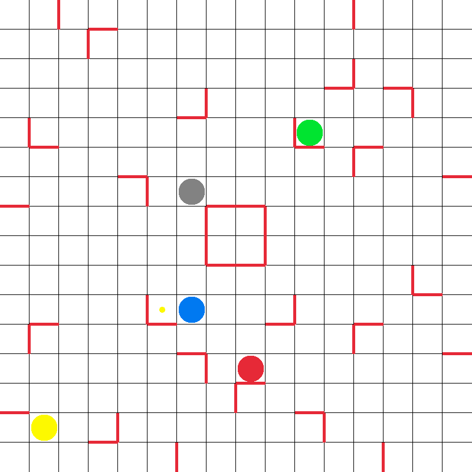

# **Ricochet Robot**

A game about reaching a point by using 5 robots

---
## Gameplay

You have 5 robots (grey, green, blue, red, yellow),  
you can move them in 4 directions (up, down, left, right),  
you can click on a robot to show the robots movements options,  
once you select a direction the robot will go in that direction until he meets an obstacle (window boundary, wall or other robot),  
you will have a goal on the screen (a little dot),  
to win the game you need to put the robot of the same color as the dot on,  
the dot and in the least moves possible !  

---
## Robots

---
## Map

